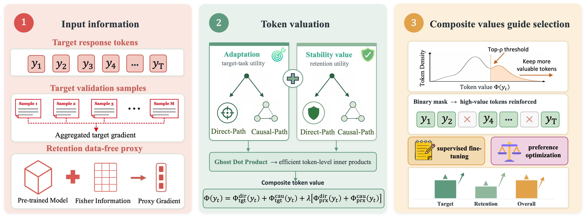

# AlphaToken: Decoupling Adaptation and Stability for Path-Aware Response Token Valuation in LLM Post-Training

**AlphaToken** is a response-token valuation framework for LLM post-training. It decouples each token's value into two objectives — **adaptation** (promoting target-task learning) and **stability** (preserving pre-trained capabilities) — and makes each objective **path-aware** by combining the direct-path signal from local token gradients with the downstream causal-path signal in autoregressive generation. Because retention data are typically unavailable to downstream practitioners, AlphaToken approximates stability via a Fisher-drift proxy anchored at the pre-trained reference model. The resulting composite token values mask low-utility response tokens during both fine-tuning and preference optimization, concentrating training on positions that better support adaptive and stable post-training.



## Core Innovations of AlphaToken

- **Decoupled and Path-Aware Response Token Valuation:** We formulate response token valuation by decoupling adaptation and retention stability, and make each objective path-aware by modeling both local update signals and downstream causal-path effects. Since the retention gradient is typically inaccessible, AlphaToken replaces it with a Fisher-weighted drift proxy anchored at the pre-trained reference model.

- **Token-Level Ghost Dot-Product Valuation:** Building on Ghost Dot-Product for sample-level gradient alignment, we extend it to token-level valuation. The framework supports causal cross-position alignment through a Value-Propagation approximation and computes Fisher-drift stability through an Activation–Parameter contraction.

- **Value-Aware Post-Training for SFT and Preference Optimization:** Using the composite token values, AlphaToken masks low-utility response tokens during both standard fine-tuning and preference optimization. This concentrates training signals on more valuable positions and improves the adaptation–retention trade-off across multiple LLM backbones.

## Requirements

**Hardware Requirements:**
- Four A100 80G GPU (Recommended for LLM experiments)

**Software Dependencies:**
```bash
torch>=2.1.0
torchvision>=0.16.0
transformers>=4.40.0
datasets>=2.18.0
accelerate>=0.29.0
peft>=0.10.0
numpy>=1.24.0
tqdm>=4.65.0
```

Install everything with:

```bash
pip install -r requirements.txt
```

## Repository Layout

```
alphatoken/
├── src/
│   ├── fisher.py        # Diagonal Monte-Carlo Fisher F_ref  (Eq. 5)
│   ├── scoring.py       # Hook manager + AlphaTokenScorer (Eqs. 8/9/11/12)
│   ├── sft_trainer.py   # Value-aware SFT loop (Algorithm 1 / Eq. 13)
│   └── dpo_trainer.py   # Value-aware DPO loop (Algorithm 1 / Eq. 14)
├── train_sft.py         # SFT entry point
├── train_dpo.py         # DPO entry point
├── scripts/
│   ├── run_sft.sh       # 4 × A100 launcher for SFT
│   └── run_dpo.sh       # 4 × A100 launcher for DPO
├── requirements.txt
└── README.md
```

## Quick Start

All paths shown as `...` should be replaced with your own locations. The shell
launchers wrap the Python entry points with `torchrun --nproc_per_node=4`.

### Supervised Fine-Tuning (Magicoder → HumanEval)

Edit the paths at the top of `scripts/run_sft.sh` (or override on the command line):

```bash
MODEL_PATH=...          # path or HF id of the pre-trained backbone
DATA_PATH=...           # JSON/JSONL list of {"prompt", "response"} dicts
OUTPUT_DIR=...          # where checkpoints + Fisher cache will land
FISHER_CACHE=...        # optional; defaults to $OUTPUT_DIR/fisher.pt
```

Then launch:

```bash
bash scripts/run_sft.sh
```

This runs `torchrun --standalone --nproc_per_node=4 train_sft.py` with the paper
defaults (`ρ=0.5`, `λ=1.5`, `K=3`, `W=32`, `B_val=32`) and a global batch of 64
(`4 GPUs × 4 micro-batch × 4 accum`).

### Preference Optimization (UltraFeedback → AlpacaEval2 / Arena-Hard)

```bash
SFT_WARMSTART_PATH=...  # UltraChat-200K warm-start checkpoint (= policy init = ref)
PREF_DATA_PATH=...      # preference triples {"prompt", "chosen", "rejected"}
VAL_SFT_DATA_PATH=...   # SFT-format examples drawn from the SAME UltraFeedback
                        # distribution, excluded from preference optimization;
                        # used only for validation-side scoring signals (Eq. 8/9)
OUTPUT_DIR=...
```

```bash
bash scripts/run_dpo.sh
```

Global batch defaults to 64 preference pairs (`4 × 2 × 8`).
